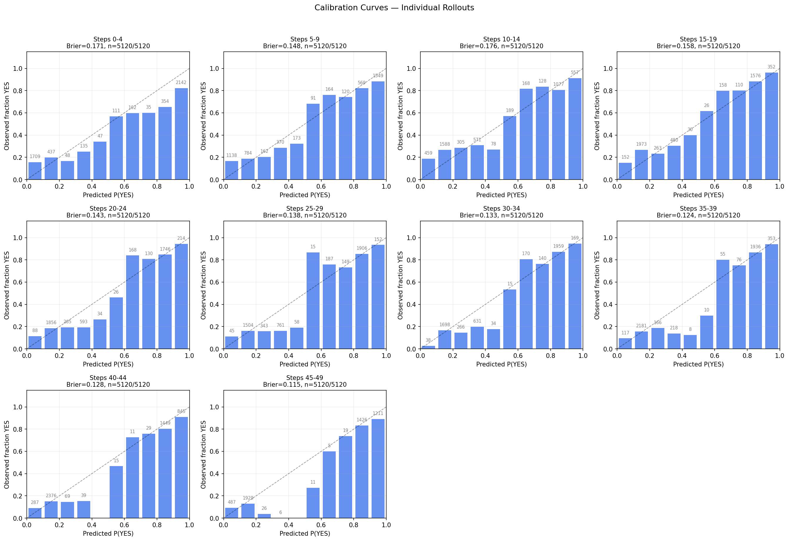
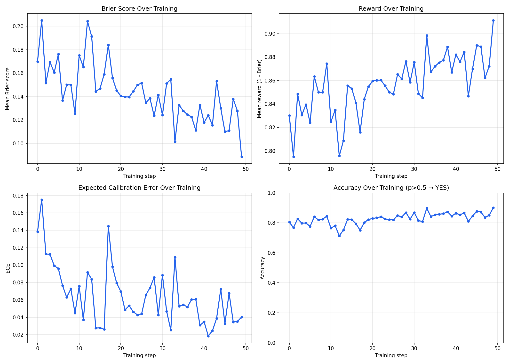

# RL for Calibration: Gemma 2 2B on BoolQ

**Model**: [eruzak/gemma-2-2b-it-reasoning-high-boolq-calibration](https://huggingface.co/eruzak/gemma-2-2b-it-reasoning-high-boolq-calibration)

Train Gemma 2 2B IT to give **calibrated YES/NO probability estimates** on BoolQ questions using RL (GRPO via [prime-rl](https://github.com/PrimeIntellect-ai/prime-rl)). The model reads a passage, reasons briefly, then outputs `ANSWER: YES/NO with XX% probability`.

**Reward = 1 − Brier score**, with a bucket length penalty to encourage chain-of-thought reasoning without rambling.

---

## Results

Training ran for **50 steps (~107 minutes) on 2× A100 80GB**.

| Metric | Step 0 | Step 49 |
|--------|--------|---------|
| Reward | ~0.38 | **0.911** |
| ECE | ~0.25 | **~0.05** |
| Accuracy | ~0.70 | **~0.86** |
| Parse rate | 100% | 100% |

The model improved dramatically in calibration: ECE dropped from ~0.25 to ~0.05, and accuracy went from ~70% to ~86%. Notably, the model was **100% parseable from step 0** — the format was learned immediately.

### Reward curve

There was a notable collapse at steps 10–12 (reward dropped from 0.86 → 0.27) caused by the model overshooting to ~750-token responses and hitting the length penalty hard. It self-corrected within 3 steps and stabilized at 0.85–0.91 for the remainder of training.

### CoT style evolution

By step 49, the model's reasoning style changed qualitatively compared to step 0:

- **Step 0**: 1–2 sentence summaries restating the passage, extreme probabilities (0% or 100%), no uncertainty acknowledgment.
- **Step 49**: 3–6 sentence arguments with nuance, hedging language when appropriate, mostly 80–95% probabilities, and spontaneous use of analogies (not trained explicitly — emerged from the reward signal).

See `results/cot_samples.txt` for 10 examples from each endpoint.

---

## Plots

| | |
|---|---|
|  |  |

---

## Architecture

### Environment (`calibrated_qa/calibrated_qa.py`)

- **Dataset**: BoolQ (`google/boolq`), balanced 50/50, with passage
- **Prompt**: Instructions + passage + question in user message (no system role — Gemma 2 doesn't support it)
- **Format**: Model outputs reasoning then `ANSWER: YES/NO with XX% probability`
- **Reward**: `1 - Brier_score` for parseable outputs, `0` for unparseable
- **Length penalty (bucket)**: Penalizes completions shorter than 1/5 or longer than 4/5 of `max_tokens`. Encourages CoT without rambling.

### Key design decisions

**Passage included**: Without the passage, small models (~2B) have only ~55% accuracy on BoolQ and collapse to predicting ~50% on everything. With the passage, accuracy is 80–86%, giving real room for calibration learning.

**No system role**: Works for all models; instructions prepended to user message instead.

**Flexible regex**: Matches `ANSWER: YES with 90% probability` and also `YES with 90% probability` (without prefix). Small models sometimes skip the `ANSWER:` prefix.

### Config

| Parameter | Value |
|-----------|-------|
| model | `google/gemma-2-2b-it` |
| batch_size | 1024 (128 questions × 8 rollouts) |
| rollouts_per_example | 8 |
| max_tokens | 512 |
| lr | 1e-6 |
| max_steps | 50 |
| max_async_level | 0 (fully on-policy) |
| seq_len | 2048 |

---

## Quickstart

See `CLAUDE.md` for instructions for running this on a fresh RunPod instance.

### Analyze existing results

```bash
pip install matplotlib numpy
python analyze_calibration.py --results-dir results --batch-size 1024 --group-size 5 --max-steps 50
```

### Sample CoT comparisons

```bash
python sample_generations.py --results-dir results --batch-size 1024 --max-steps 50 --n 10
```

---

## Files

```
├── calibrated_qa/          # prime-rl environment package
│   ├── calibrated_qa.py    # dataset, prompt, reward function
│   └── pyproject.toml
├── configs/
│   └── calibrated_qa_gemma2_2b.toml   # prime-rl training config
├── setup_runpod.sh         # installs prime-rl on a fresh RunPod
├── run_training.sh         # runs training (requires HF_TOKEN)
├── analyze_calibration.py  # produces plots and CSVs from generations.jsonl
├── sample_generations.py   # samples CoT completions from first/last step
└── results/
    ├── generations.jsonl.gz        # all 51,200 rollouts (compressed)
    ├── orchestrator.stdout         # full training log with per-step rewards
    ├── calibration_metrics.csv     # per-generation metrics
    ├── cot_samples.txt             # 10 samples from step 0 vs step 49
    ├── calibration_curves.png      # reliability diagrams per 5-step group
    └── brier_over_time.png         # reward, Brier, ECE, accuracy over training
```
